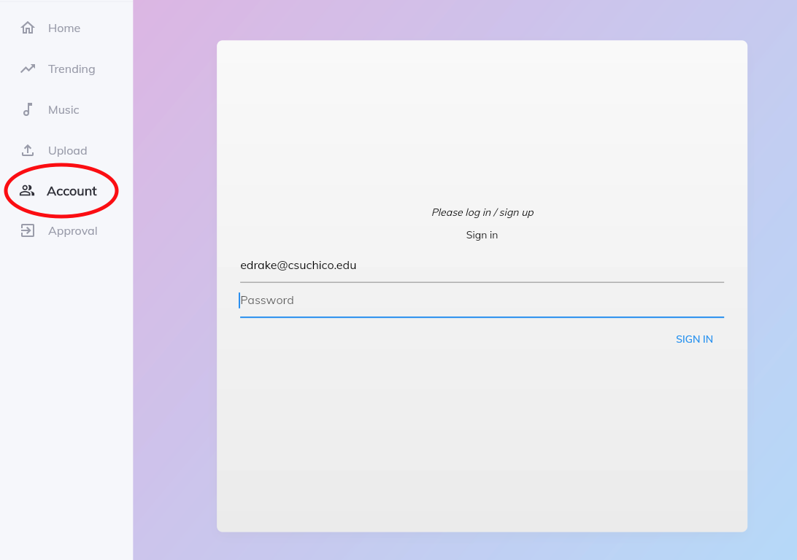
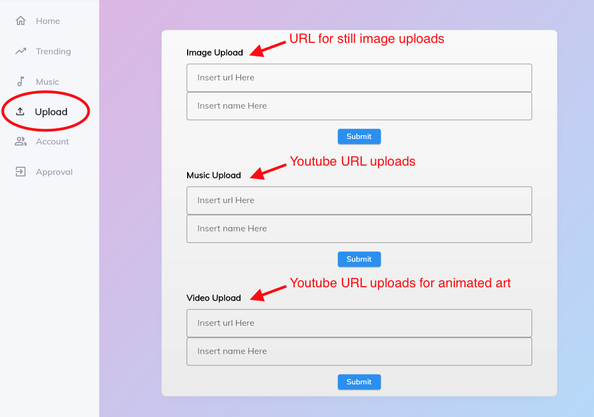

# Testing Badges
[](https://github.com/ChicoState/sound-space/actions/workflows/build_test.yml)
[](https://github.com/ChicoState/sound-space/actions/workflows/flutter_testing.yml)

# This Sound Space
Sound Space is a place for music lovers. Musicians, Artists and Listeners
are all welcome. The general idea behind Sound Space is that Musicians will
create and post music, and that music will cause inspiration in Artists
and listeners alike.

## Flow
- Step 1: users must create an account before they can do anything
- 
- Step 2: whether you are an artist or a musician you can upload your media
	from our uploads center.
- 
- - everything you upload will be attached to your users account.
- Musician step 3: Listen to your or others music.
<!-- screen shot of music page -->
- Artist step 3: apply to have your art attached to someones muisic.
<!-- screen shot of application proccess -->


# DEVELOPMENT

## Process
- Step 1: install flutter
- Step 2: flutter pub get
- Step 3: take an issue
- Step 4: if all tests are passing submit pull request for eval
- Step 5: get pushed into main branch

## to use docker
- view website: docker-compose up -d and go to url localhost:8000
- stop container: docker-compose down
- dm cli deprecated

## Metrics
- for metrics we use dart-analyze
- more helpful we use dart-code-metrics
- - ``` flutter pub run dart_code_metrics:metrics check-unused-code lib ```
- - ``` flutter pub run dart_code_metrics:metrics analyze lib ```
- - ``` flutter pub run dart_code_metrics:metrics check-unused-files lib ```
- These commands will produce terminal output with information on our current code
- metrics config can be found and/or changed in [analysis options](https://github.com/ChicoState/sound-space/blob/1b5d66053df0ce7d5739fe8e29c68957004d55e3/analysis_options.yaml)
